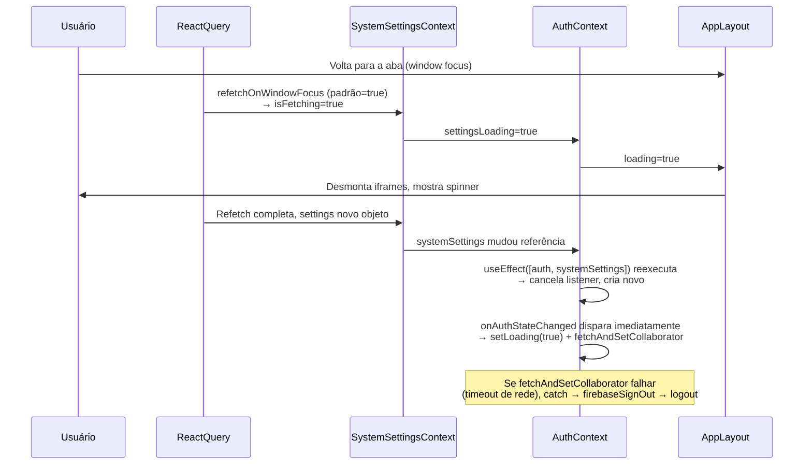

# Correção do Reset de Sessão ao Trocar de Aba

## Objetivo

- **Não deslogar** o usuário por pelo menos **12 horas** de uso (incluindo tempo com a aba em background ou em outra aba).
- Trocar de aba **não** deve causar logout nem reset para a tela de login.
- O timer de inatividade (logout por falta de interação) deve ser de **no mínimo 12h**; hoje está em 24h em `[AppLayout.tsx](src/components/layout/AppLayout.tsx)` (linha 354), portanto já atende — será mantido ou ajustado apenas se for reduzido no futuro.

## Diagnóstico

Foram identificadas **5 causas encadeadas** que produzem o logout ao retornar à aba. O fluxo problemático é:




## Causas Raiz (por ordem de impacto)

**Causa 1 — `refetchOnWindowFocus` ativo por padrão no React Query**

- Arquivo: `[src/components/providers/ReactQueryProvider.tsx](src/components/providers/ReactQueryProvider.tsx)`
- O `QueryClient` não desativa `refetchOnWindowFocus`. Ao voltar à aba, TODAS as queries stale (incluindo `systemSettings`) são reexecutadas, disparando toda a cadeia abaixo.

**Causa 2 — `settingsLoading` incluído no `loading` do AuthContext**

- Arquivo: `[src/contexts/AuthContext.tsx](src/contexts/AuthContext.tsx)` linha 315
- `loading: loading || settingsLoading` — qualquer refetch de settings (background ou por foco) seta `loading=true` no auth, o que faz o `AppLayout` mostrar o spinner e **desmontar os iframes**.

**Causa 3 — `systemSettings` no array de dependências do `onAuthStateChanged`**

- Arquivo: `[src/contexts/AuthContext.tsx](src/contexts/AuthContext.tsx)` linha 169
- `}, [auth, systemSettings, fetchAndSetCollaborator])` — quando `systemSettings` muda de referência (após refetch), o `useEffect` recria o listener. O Firebase dispara o callback imediatamente, `setLoading(true)` é chamado, e se `fetchAndSetCollaborator` lançar qualquer erro, o `catch` executa `firebaseSignOut` → logout real.

**Causa 4 — `onAuthStateChanged` no `SystemSettingsContext` invalida queries a cada auth event**

- Arquivo: `[src/contexts/SystemSettingsContext.tsx](src/contexts/SystemSettingsContext.tsx)` linhas 64–69
- Isso cria um loop: auth muda → settings invalidadas → settings refetcham → `systemSettings` muda → `useEffect` do AuthContext reexecuta → novo listener `onAuthStateChanged` → Firebase dispara callback → potencial erro → logout.

**Causa 5 — `auth` instanciado dentro do componente `AuthProvider`**

- Arquivo: `[src/contexts/AuthContext.tsx](src/contexts/AuthContext.tsx)` linha 70
- `const auth = getAuth(app)` dentro do corpo do componente. Embora `getAuth` seja singleton, é boa prática mover para fora para garantir estabilidade de referência.

## Plano de Correção (5 mudanças cirúrgicas)

### Fix 1 — `ReactQueryProvider.tsx`: desativar `refetchOnWindowFocus`

```diff
- staleTime: 1000 * 60 * 5,
+ staleTime: 1000 * 60 * 5,
+ refetchOnWindowFocus: false,
```

### Fix 2 — `AuthContext.tsx`: remover `settingsLoading` do `loading` exportado

```diff
- loading: loading || settingsLoading,
+ loading: loading,
```

### Fix 3 — `AuthContext.tsx`: usar `useRef` para `systemSettings` e removê-lo das dependências

```diff
+ const systemSettingsRef = useRef(systemSettings);
+ useEffect(() => { systemSettingsRef.current = systemSettings; }, [systemSettings]);

  useEffect(() => {
    const unsubscribe = onAuthStateChanged(auth, async (firebaseUser) => {
-     const { maintenanceMode, ... } = systemSettings;
+     const { maintenanceMode, ... } = systemSettingsRef.current;
      // ...
    });
    return () => unsubscribe();
- }, [auth, systemSettings, fetchAndSetCollaborator]);
+ }, [auth, fetchAndSetCollaborator]);
```

### Fix 4 — `SystemSettingsContext.tsx`: remover o `onAuthStateChanged` que invalida queries

```diff
- React.useEffect(() => {
-   const unsubscribe = onAuthStateChanged(auth, (user) => {
-     queryClient.invalidateQueries({ queryKey: [COLLECTION_NAME, DOC_ID] });
-   });
-   return () => unsubscribe();
- }, [auth, queryClient]);
```

As settings serão carregadas na montagem do provider (comportamento padrão do React Query com `queryFn`) e revalidadas apenas pelo `staleTime`.

### Fix 5 — `AuthContext.tsx`: mover `auth` para fora do componente

```diff
+ const _app = getFirebaseApp();
+ const _auth = getAuth(_app);

  export const AuthProvider = ({ children }) => {
-   const app = getFirebaseApp();
-   const auth = getAuth(app);
+   const auth = _auth;
    // ...
  }
```

## Arquivos Afetados

- `[src/components/providers/ReactQueryProvider.tsx](src/components/providers/ReactQueryProvider.tsx)` — 1 linha adicionada
- `[src/contexts/AuthContext.tsx](src/contexts/AuthContext.tsx)` — ~10 linhas alteradas
- `[src/contexts/SystemSettingsContext.tsx](src/contexts/SystemSettingsContext.tsx)` — ~6 linhas removidas

## Garantia de 12h sem logout

- **Timer de inatividade:** em `[AppLayout.tsx](src/components/layout/AppLayout.tsx)` o `INACTIVITY_TIMEOUT` está em **24 horas**; deve permanecer **≥ 12h**. Nenhuma alteração necessária para atender ao requisito; apenas documentar/validar que não será reduzido abaixo de 12h.
- **Troca de aba:** os fixes 1–5 eliminam o logout causado por refetch/loading ao voltar da aba; a sessão permanece ativa independentemente do tempo em outra aba (respeitando apenas o limite de inatividade acima).

## Validação

Após aplicar os fixes, testar manualmente:

1. Logar na aplicação
2. Abrir DevTools → Console
3. Ir para outra aba por 5–10 minutos (ou mais)
4. Voltar e verificar: **sem desmontagem de iframe, sem spinner, sem redirect para login**
5. Confirmar no console que não há logs de `onAuthStateChanged` sendo disparados ao retornar
6. (Opcional) Deixar a aba em background por período longo (ex.: 1h+) e confirmar que ao voltar a sessão segue ativa — objetivo é **pelo menos 12h** sem deslogar por troca de aba

